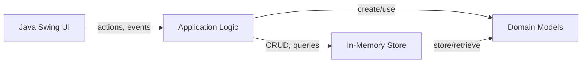
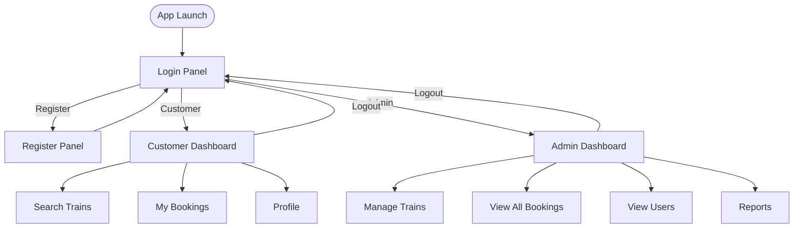
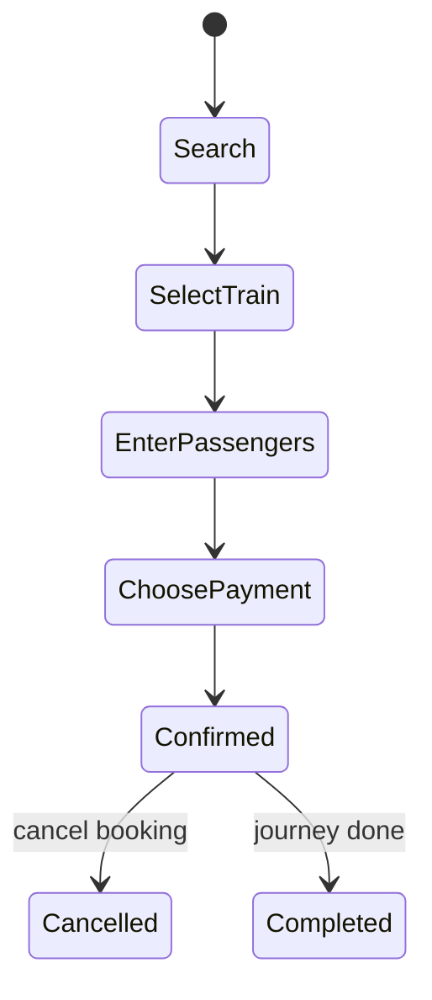
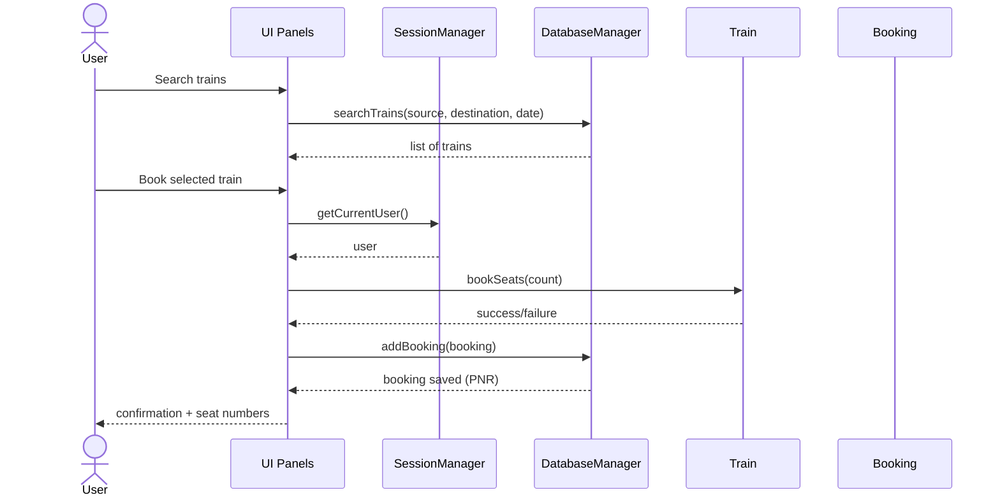
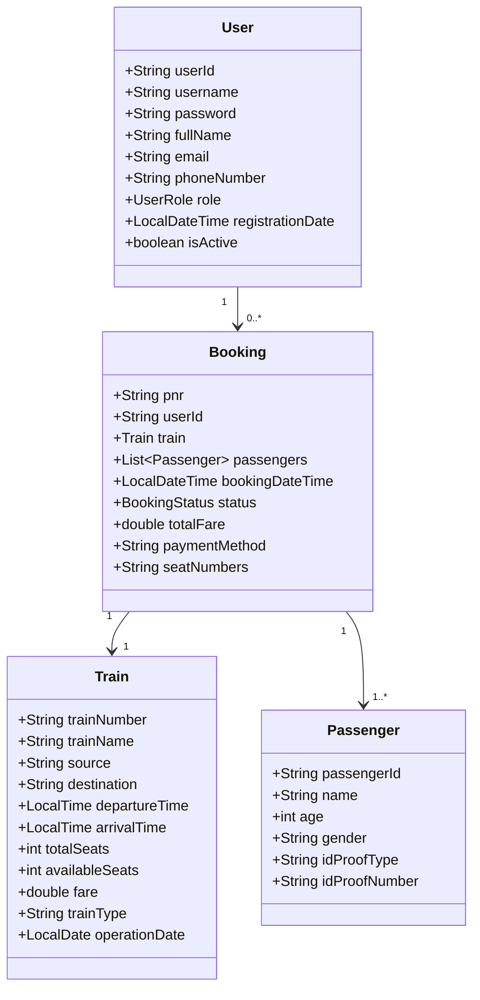

# Railway Reservation Management System

A desktop-based Railway Reservation Management System built with Java Swing. It supports customer ticket booking workflows and administrator operations like train management, booking monitoring, user lookup, and reporting.

## Highlights

- Java Swing GUI with separate customer and admin dashboards
- User registration, login, and session-based access
- Train search by source, destination, and travel date
- Ticket booking with multiple passengers and payment method capture
- Booking history and cancellation flow
- In-memory data layer using thread-safe collections
- Validation and custom exception handling across modules

## Tech Stack

- Language: Java 8+
- UI: Swing (JFrame, JPanel, CardLayout, JTable, dialogs)
- Data store: In-memory singleton repository using `ConcurrentHashMap`
- Date/time API: `LocalDate`, `LocalTime`, `LocalDateTime`
- Style: Centralized UI theme utilities

## Project Structure

```text
Railway-Reservation-Management/
|- src/
|  |- gui/
|  |  |- RailwayReservationApp.java
|  |  |- LoginPanel.java
|  |  |- RegisterPanel.java
|  |  |- CustomerDashboard.java
|  |  |- AdminDashboard.java
|  |  |- SearchTrainsPanel.java
|  |  |- BookingDialog.java
|  |  |- MyBookingsPanel.java
|  |  |- ProfilePanel.java
|  |  |- ManageTrainsPanel.java
|  |  |- ViewAllBookingsPanel.java
|  |  |- ViewUsersPanel.java
|  |  |- ReportsPanel.java
|  |  |- UIStyles.java
|  |- models/
|  |  |- User.java
|  |  |- Train.java
|  |  |- Passenger.java
|  |  |- Booking.java
|  |- utils/
|  |  |- DatabaseManager.java
|  |  |- SessionManager.java
|  |  |- ValidationUtils.java
|  |- exceptions/
|     |- RailwayReservationException.java
|     |- AuthenticationException.java
|     |- BookingException.java
|     |- InsufficientSeatsException.java
|     |- TrainNotFoundException.java
|     |- ValidationException.java
|- docs/
|  |- SETUP.md
|  |- USER_GUIDE.md
|- START.sh
|- LAUNCH.bat
|- README.md
```

## Getting Started

### Prerequisites

- JDK 8 or higher
- A terminal (Linux/macOS) or Command Prompt/PowerShell (Windows)

### Run on Linux/macOS

```bash
chmod +x START.sh
./START.sh
```

## System Diagrams

### High-Level Architecture



### App Navigation Flow



### Booking Lifecycle



### Component Interaction (Sequence)



### Data Model (Core Classes)



### Run on Windows

- Double-click `LAUNCH.bat`
or

```bat
LAUNCH.bat
```

### Manual Compile and Run

```bash
cd /workspaces/Railway-Reservation-Management
mkdir -p bin
javac -d bin src/models/*.java src/exceptions/*.java src/utils/*.java src/gui/*.java
java -cp bin gui.RailwayReservationApp
```

### Run from IDE

1. Open project in IntelliJ IDEA / Eclipse / VS Code.
2. Mark `src` as source root.
3. Run main class: `gui.RailwayReservationApp`.

## Demo Credentials

Pre-seeded users in `DatabaseManager`:

- Admin: `admin` / `admin123`
- Customer: `john_doe` / `pass123`
- Customer: `jane_smith` / `pass123`
- Customer: `rahul_kumar` / `pass123`

## Seeded Train Data

The app initializes multiple routes for today and upcoming dates, including:

- Delhi -> Mumbai (Rajdhani Express)
- Delhi -> Chandigarh (Shatabdi Express)
- Mumbai -> Kolkata (Duronto Express)
- Delhi -> Bangalore (Garib Rath)
- Chennai -> Delhi (Humsafar Express)
- Kolkata -> Bangalore (Sampark Kranti)
- Mumbai -> Chennai (Mumbai Express)
- Delhi -> Kolkata (Howrah Express)

## Functional Overview

### Customer Capabilities

- Register account with field-level validations
- Login and access customer dashboard
- Search trains by route and date
- Book 1 to 6 passengers in a single transaction
- Select payment mode (Credit Card, Debit Card, UPI, Net Banking, Cash)
- View booking history
- Cancel confirmed bookings
- View profile and change password

### Admin Capabilities

- View all trains
- Add and delete trains
- View all bookings system-wide
- View all users
- See reports/analytics cards and revenue summaries

## Validation Rules

Validation is centralized in `ValidationUtils`:

- Email: must match standard email pattern
- Phone: 10-digit Indian mobile (`^[6-9]\d{9}$`)
- Username: 3 to 20 characters, letters/numbers/underscore
- Password: minimum 6 characters
- Name: minimum 2 characters
- Passenger age: 1 to 120
- Seat request per booking: 1 to 6

## Architecture Notes

### App Bootstrapping

- Entry point: `gui.RailwayReservationApp`
- Uses `CardLayout` for screen switching (login/register/dashboards)
- Applies shared theme through `UIStyles`

### Core Singletons

- `DatabaseManager`
	- Central in-memory repository for users, trains, bookings, passengers
	- ID generators (`Uxxxxxx`, `Pxxxxxx`, `PNR...`)
	- Search and CRUD helpers for entities
- `SessionManager`
	- Handles login/logout state
	- Tracks current user and role checks

### Models

- `User`: identity, credentials, role, status
- `Train`: route, timings, seat counters, fare, operation date
- `Passenger`: traveler details per booking
- `Booking`: PNR, train, passengers, status, fare, payment method, seat list

### Booking and Seat Behavior

- Booking confirms immediately when enough seats exist
- Available seats decrease on booking
- On cancellation, seats are restored to train capacity limits
- Seat numbers are auto-generated as sequential values from a random base

## Known Characteristics and Limitations

- Data is in-memory only; restarting app resets runtime changes
- Passwords are stored as plain strings (no hashing)
- No external DB integration in current implementation
- No automated tests included yet

## Troubleshooting

### `javac: command not found`

- Install JDK and add Java to PATH.

### App compiles but GUI does not open

- Ensure you run with a desktop environment and a JDK with Swing support.

### No trains in search result

- Verify source/destination/date combination exists in seeded data.
- Ensure date is valid and not unintended past date input.

### Login fails

- Check exact username/password.
- Use one of the demo credentials above.

## Development Notes

- Source lives in `src/*`, compiled classes in `bin/*`.
- Existing docs:
	- `docs/SETUP.md`
	- `docs/USER_GUIDE.md`

## Contributing

Contributions are welcome for educational and improvement purposes.

1. Fork the repository
2. Create a feature branch
3. Commit focused changes
4. Open a pull request with clear description and screenshots (if UI-related)

## License

See `LICENSE` for license details.

## Author

- Kunal
- GitHub: https://github.com/Kunal88591